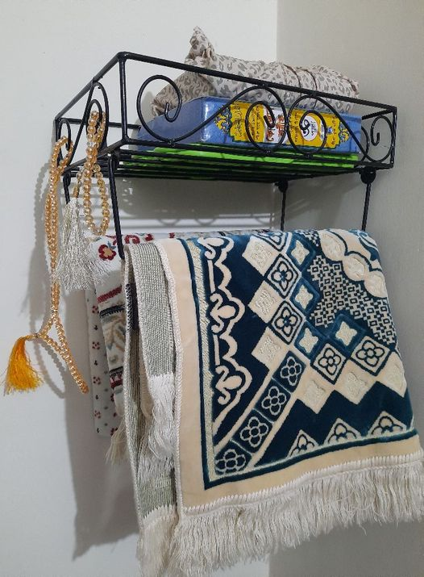

<!-- markdown toutorial -->
my name is md karmrul hasan rakib  <br/> 
this is second line  
---
# Kamrul Haan Rakib
## Kamrul Haan Rakib
### Kamrul Haan Rakib
#### Kamrul Haan Rakib

### paragraph
<p> hey this is md kamrul hasan rakib, i am 26 years old. and i am a student of national university of bangladesh. i am graduating with physics.<p>  

### italic text
_this is italic text_  

### bold text
__this is bold text__

<del>delete text of html</del>

~~the delete text~~  
`This is inline`
```html
<html>
<head></head>
<body></body>
```

```javascript
const method=()=>{
    console.log("hello")
}
```
### orderlist..  

1. Item1  
   1. Item 1.1
      1. Item 1.1.2
          
      2. Item 1.1.3
   2. Item 1.2
   2. Item 1.2
   2. Item 1.2
   2. Item 1.2
   2. Item 1.2
   2. Item 1.2
   2. Item 1.2
   2. Item 1.2
   

2. Item2  

### unorder list  
- item1
  - item1.1
    - item1.1.2
       - item infinity
    - item1.1.3
  - item1.2
    
  - item1.3

- item2 
- item3  

### Task List  

- [x] Task1
- [x] Task2
- [x] Task3
- [] 


### Automatic Link
http://www.google.com


### disabled link
`http://www.google.com `


### markdown link syntax
[GOOGLE](http://www.google.com)


### multiple link
[Doogle][websitelink]

[websitelink]: http://www.google.com

### IMAGE syntax  
 <!--  -->

 
 
### Table syntax


|Name|Email|
| ---- | ----|
|Rakib|kamrulhasanrakib99@gmail.com|
